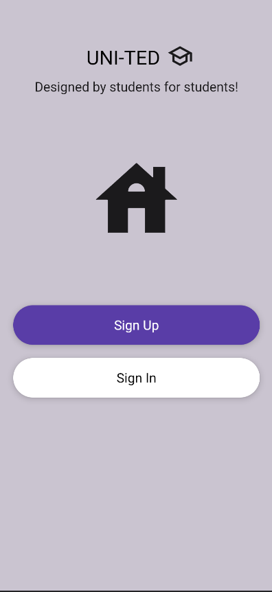
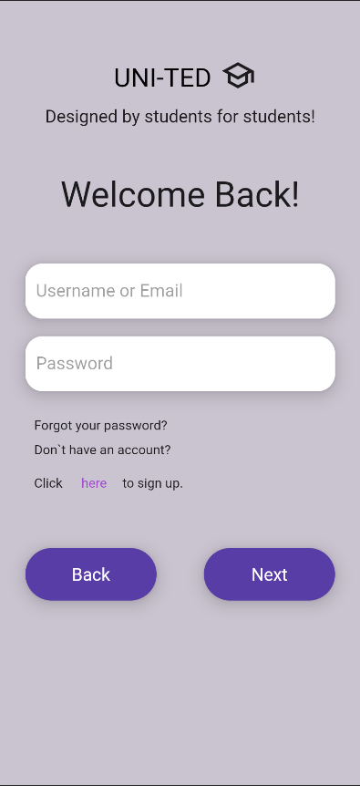
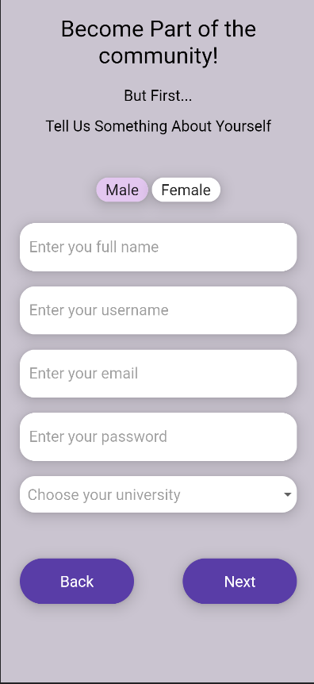
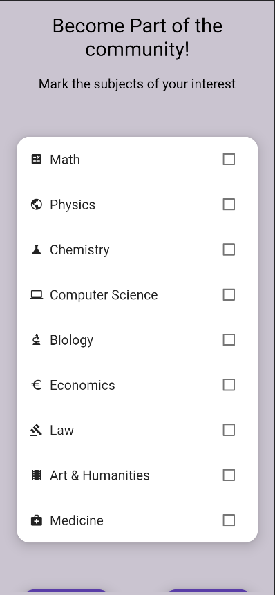
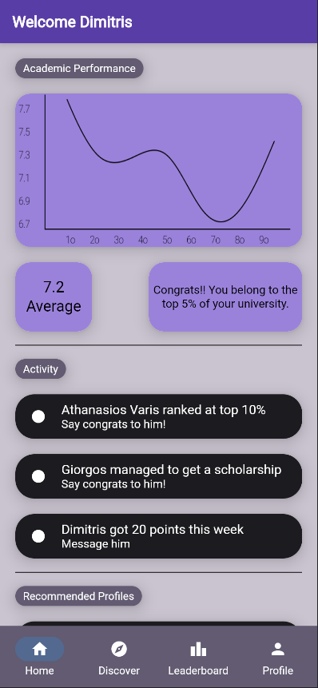
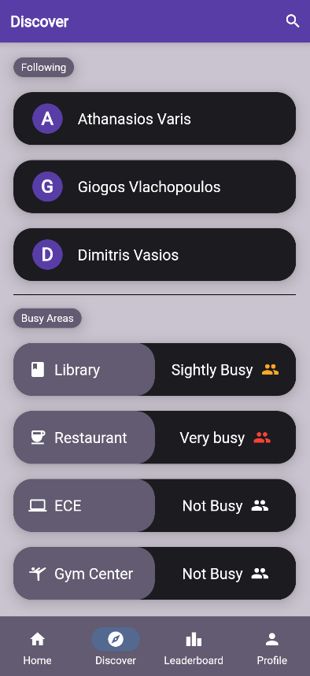
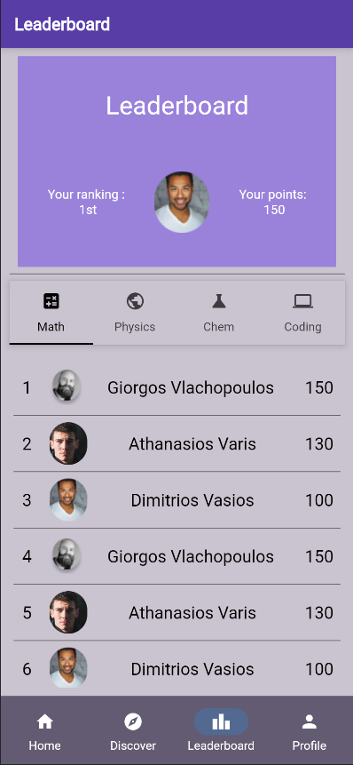
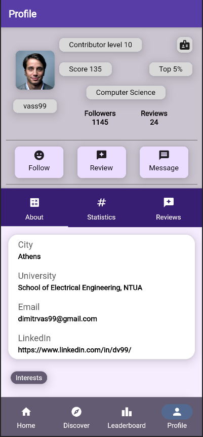

# United App

This repository contains a flutter project implemented in Flutter as part of the "Human Computer Interaction" course at the School of Electrical & Computer Engineering, National Technical University of Athens (NTUA).

## About the app

Title: United\
Category: Education, Social\
Promo: Designed by students for students

UNI-TED is the 1st application that aims to provide significant tools to students and network the Greek university student community. Each student has the opportunity to navigate digitally within the application, view their grades, learn about the interests and achievements of other students, interact with them, and assist other students with the same academic field. Additionally, it motivates students to achieve better results, improve their grades, participate more actively in university life, and engage in various student groups.

## Features

- View academic achievements and reviews.
- View profiles of other students.
- Create reviews for other students based on their knowledge.
- View rankings with specific filters.
- View busy areas of the university

## Page Views

### Registration

    
    
    
    

### Application

    
    
    
    

## Technologies Used

- Flutter: The framework used for building the app's user interface and logic.
- Dart: The programming language used by Flutter for app development.

## Installation

1. Clone the repository: git@github.com:DVasios/Algorithmic-Tasks.git
2. Navigate to the app directory: cd United-App
3. Ensure you have Flutter installed on your system. If not, refer to the Flutter installation guide.
4. Connect your device/emulator, run: flutter devices to check the available devices.
5. Run the app using: flutter run

## Contributors

Dimitris Vasios, ECE NTUA\
Athanasios Varis, ECE NTUA

## Contact Us
If you have any questions or need support, feel free to contact us at dpvasios@gmail.com.

Thank you for your interest in our mobile app!